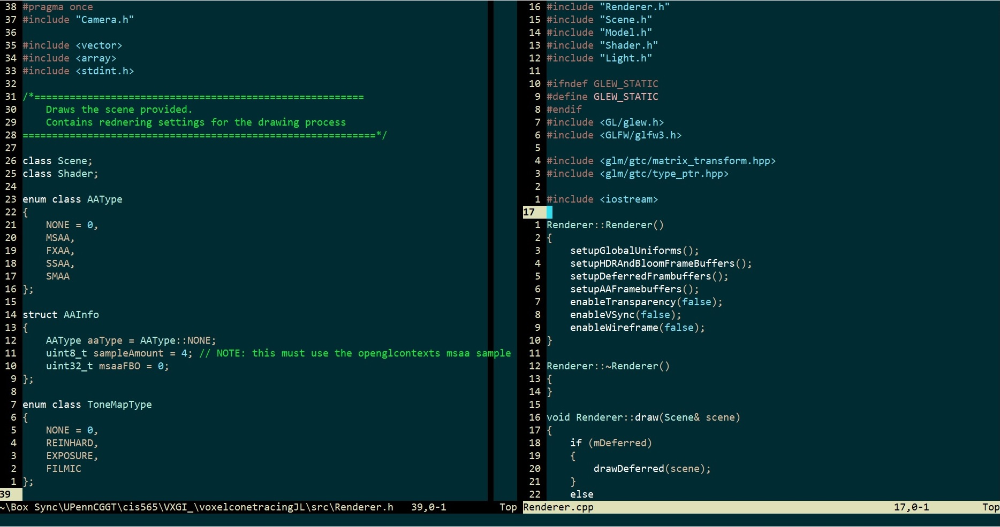

# magicka.vim

The `magicka` colorscheme for Vim

## Installation (Windows)
   * Stick the `magicka.vim` file in your `~/vimfiles/colors` folder
   
## Installation (Linux/OSX)
   * Stick the `magicka.vim` file in your `~/.vim/colors` folder.

## Configuration

Just edit your `~/_vimrc` (Windows) or `~/.vimrc` (Linux/OSX) to add:

    syntax on
    colorscheme magicka

---
